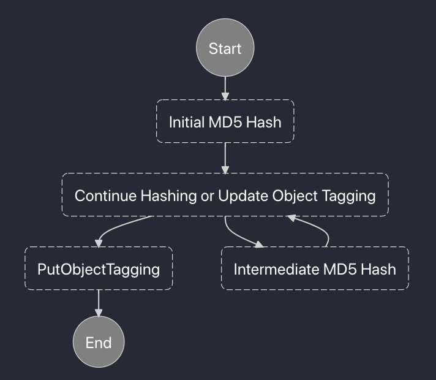

- [Introduction](#introduction)
- [The Details](#the-details)
  - [The State Machine](#the-state-machine)
  - [Deployment](#deployment)
- [Footnote](#footnote)

## Introduction

MD5 hashes, or checksums, provide an almost-unique signature to files that can be used for non-cryptographic purposes like verifying data integrity or implementing a content addressable filesystem. Amazon Web Services (AWS) S3 uses something similar for object `ETag`s. For small objects uploaded in a single API call, the `ETag` is equivalent to the MD5 hash. However, if the object was uploaded using a multipart upload, then the `ETag` will be a different identifier, still based on the object contents but much less useful.

For our use case, we have a significant number of objects uploaded in multiple parts, and we need the MD5s in order to POST metadata objects in a database. Furthermore, the objects need to be posted in a particular order so it is not trivially parallelizable. One solution would be to just compute the hashes at POST time, however this doesn't scale well. What we really need is a way to compute and store the hashes beforehand.

## The Details

A reasonable time to compute the MD5 hashes would be at object upload time. By listening to  `CompleteMultipartUpload` and `PutObject` events on our target bucket we could trigger the computation. We could opt to periodically scrape the bucket and determine which objects need hashes, this will add quite a bit of logic to determine which objects need updating.

To store the hashes, we can use S3 object tags. While object metadata is immutable, tags can be freely updated any time via `PutObjectTagging`. Another option would be to use a key-value store like DynamoDB, but keeping the md5sum attached to the object is simpler and sufficient for our use case.

To actually calculate the hashes, using something serverless is ideal. The workload is very bursty, with files added to the bucket in batches with long periods of inactivity. Here we use Lambda. However, some of the files are so big that it will take longer than the maximum Lambda duration of 15 minutes to compute the hash. Fortunately, the [MD5 algorithm](https://en.wikipedia.org/wiki/MD5#Algorithm) processes a message (i.e. a finite sequence of bytes) in chunks, with the output at each step only depending on the previous state and the current chunk. Therefore, we can pass off state of the hash from one Lambda invocation to another. In Python, you might think that picking the `hashlib.md5` objects would work, but it turns out they are not pickleable. As an alternative, we can use the convenient [`rehash` library](https://github.com/kislyuk/rehash/) which provides the same interface as the hasher in the standard library but can be pickled.

### The State Machine

How are the Lambda functions going to coordinate with each other? What are the inputs and outputs going to look like? It is tempting to just jam everything into a single function for ease of deployment, but dealing with the variable inputs and outputs is going to be complicated. A better solution is to use Step Functions. There we can split the work among several Lambda functions, each dealing with only one well-defined input and output and only doing one thing. Each step receives a (deserialized) JSON input and can output only one JSON-serializable object. You can see the structure of the state machine below.

The state machine is comprise of four states, with three Lambda functions:
* `Initial MD5 Hash` is a function that receives the events from S3 and starts computing the MD5. It is the starting state and is only executed once. If the object `ETag` is the MD5, then we can just output it as the final hash without computing anything, otherwise we start hashing. Before processing each chunk of the hash we obtain the time left via the Lambda's `context.get_remaining_time_in_millis`. If we're still processing and there is not much time left, we serialize the state of the hasher (pickle and convert to hex), note the byte position where hashing should be resumed from, and return. If processing finishes during this step, we just return the final hash.
* `Continue Hashing or Update Object Tagging` determines if the output of either `Initial MD5 Hash` or `Intermediate MD5 hash` includes the final hash based on the presence of the hash value in the event. If the hash is complete it forwards it for tag updating, otherwise it triggers further computation. Note that this does not have a corresponding Lambda function, rather it represents a [`Choice` state in Amazon States Language](https://docs.aws.amazon.com/step-functions/latest/dg/amazon-states-language-choice-state.html). In this way the functions don't need to contain any conditional branching logic.
* `Intermediate MD5 Hash` takes in the serialized hasher state and a starting byte, deserializes the hasher, and resumes hashing from the specified byte. It either outputs a final hash value if it completes in the allotted time or outputs a new serialized hasher and start byte in a manner similar to `Initial MD5 Hash`. 
* `PutObjectTagging` does what it says it does, it just appends the MD5 hash to the object tags. This is the terminal state and is only executed at most once.

To trigger the state machine we can set up CloudTrail and EventBridge in a manner similar to the [Step Functions docs](https://docs.aws.amazon.com/step-functions/latest/dg/tutorial-cloudwatch-events-s3.html). We create a trail on our bucket of interest and then use an EventBridge rule to trigger the state machine on the correct S3 events.

### Deployment

This might sound exceedingly complex to deploy, and certainly it would be if you had to do it manually. Thankfully, we can use the AWS Serverless Application Model (SAM) and CloudFormation to define the entire stack in a relatively compact [YAML file](https://github.com/ENCODE-DCC/s3-md5-hash/blob/dev/template.yaml). We can also parametrize the entire config by the bucket we want to use as the event source so it can be deployed on different buckets with ease.

## Footnote

AWS Batch on spot instances is a potential alternative. While it would allow for computing the hash in a single job, it would require maintaining a Docker image. By using Lambda and SAM we can just have one Python file and a `requirements.txt` per function. It also might be more expensive for the compute. The cheapest spot instance in us-west-2 is a `t4g.nano` which at the time of writing costs $0.0015/hour. Compare that to the base Lambda 128 MB RAM which costs $0.0000000021/millisecond, or $0.00756/hour. You would need to do more thorough benchmarking though because the hashing performance is network-bound and the instance/Lambda specs don't provide significant detail in that regard. More expensive instances might be worth it if the higher network throughput reduces the runtime sufficiently.
